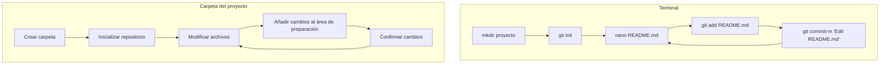
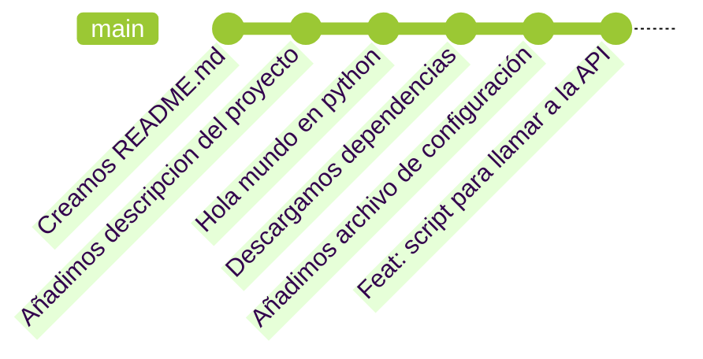
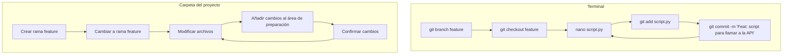
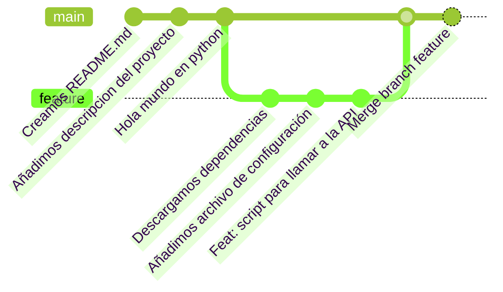

# Flujo de trabajo en Git

Imaginemos un escenario en el que iniciamos un proyecto en el que solo vamos a trabajar nosotros. En este caso, el flujo de trabajo es muy sencillo:

1. Creamos una carpeta para el proyecto.
2. Inicializamos un repositorio de Git con `git init`.
3. Hacemos cambios en el repositorio, crear archivos, modificarlos, eliminarlos, etc.
4. Añadimos los cambios al área de preparación con `git add <file>`.
5. Confirmamos los cambios con `git commit -m <mensaje>`.

## Estructura de cambios en el repositorio

Los cambios se representan como una rama en la historia del proyecto:

## Ramas en Git

Hemos visto como los cambios se acumulan en una rama en la historia del proyecto. En Git, las ramas son una forma de separar el flujo de trabajo en diferentes líneas de tiempo. Por defecto, Git crea una rama principal llamada `main`. Sin embargo, podemos crear nuevas ramas para trabajar en nuevas funcionalidades sin afectar el flujo de trabajo principal.

## Fusionar ramas

Una vez que hemos terminado de trabajar en una rama, podemos fusionarla con la rama principal usando el comando `git merge <branch>`.

## Resolución de conflictos

En ocasiones, al fusionar dos ramas, puede haber conflictos entre los cambios realizados en ambas ramas. En este caso, Git nos pedirá que resolvamos los conflictos manualmente.

VSCode nos muestra los conflictos en los archivos afectados. Podemos resolverlos manualmente y luego confirmar los cambios.

Los conflictos pueden asustar, pero recordad que en realidad, solo teneis tres opciones:

1. Aceptar los cambios de la rama actual.
2. Aceptar los cambios de la rama a fusionar.
3. Modificar los cambios manualmente porque te interesa una mezcla de ambos o ninguno.

## TLDR

- Iniciamos con `git init`.
- Hacemos cambios en el repositorio con `git add` y `git commit`.
- Estos cambios se acumulan en una rama en la historia del proyecto.
- Podemos crear nuevas ramas para trabajar en nuevas funcionalidades con `git branch <branch>`.
- Podemos fusionar ramas con `git merge <branch>`.
- En caso de conflictos, resolvemos manualmente y confirmamos los cambios.

## Referencias y recursos

- [No Deep Shit Git](https://rogerdudler.github.io/git-guide/)
- [Learn Git Branching](https://learngitbranching.js.org/?locale=es_ES)
- [Git Visualizator](https://git-school.github.io/visualizing-git/)
- [Git guide](https://glasskube.dev/guides/git/)